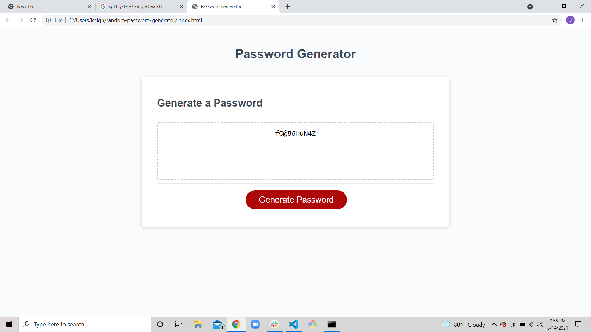

# random-password-generator

## Description

-  The motivation was to generate a random password between 8 and 128 digits long that can potentially have uppercase characters, lowercase characters, special characters, and numbers depending on what the user selects.

- This project was created to generate random passwords for better security on the internet. 

- Once you press the generate password button, at the top of your screen you will be asked what kind of specific characters you would like to have in your password and it will generate that kind of password. 

- This project solves the problem of people being able to guess your password based of information they may have about you. 

- I learned that .push(getrandom) grabs a random number out of whatver array you decide. 

## Usage

- When you first get to the website press the generate password button. Once you do that it will ask you how long do you want your password to be, which characters would you like your password to have and it will generate it to your liking. 

